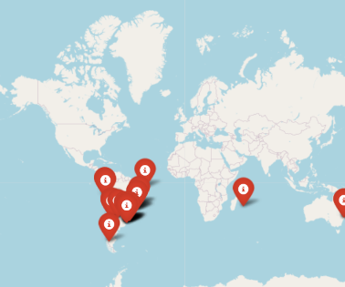

# MCIS6273 Data Mining (Prof. Maull) / Fall 2025 / HW2

| Points  Possible | Due Date | Time Commitment  (estimated) |
|:---------------:|:--------:|:---------------:|
| 16 | Friday October 10 @ Midnight | _up to_ 20 hours |

* **GRADING:** Grading will be aligned with the completeness of the objectives.

* **INDEPENDENT WORK:** Copying, cheating, plagiarism  and academic dishonesty _are not tolerated_ by University or course policy.  Please see the syllabus for the full departmental and University statement on the academic code of honor.

## OBJECTIVES
* Perform basic data statistical analysis on the GaN light pollution dataset.

* Use basic Pandas plotting tools to explore GaN light pollution data features.

* Use basic Folium to plot geographic data from GaN light pollution data features.

* Complete the online assessment

## WHAT TO TURN IN
You are being encouraged to turn the assignment in using the provided
Jupyter Notebook.  To do so, make a directory in your Lab environment called
`homework/hw2`.   Put all of your files in that directory.  Then zip or tar that directory,
rename it with your name as the first part of the filename (e.g. `maull_hw2_files.zip`, `maull_hw2_files.tar.gz`), then
download it to your local machine, then upload the `.zip` to Blackboard.

If you do not know how to do this, please ask, or visit one of the many tutorials out there
on the basics of using zip in Linux.

If you choose not to use the provided notebook, you will still need to turn in a
`.ipynb` Jupyter Notebook and corresponding files according to the instructions in
this homework.

## ASSIGNMENT TASKS
### (30%) Perform basic data statistical analysis on the GaN light pollution dataset. 

This may be the last of the GaN light pollution dataset,
but since we have been having so much fun with it thus
far, we're going to push it through one more round
before moving on to another dataset.

We've now learned about some of the statistical 
foundations for data mining and now it is time to 
apply some of those concepts concretely in [Pandas](https://pandas.pydata.org).

First and foremost, we are going to do what I call
"warming up to the dataset".  We will look at it by
asking some basic questions about what is in it --
what is its statistical shape, so we can have a good
idea about where the interesting data is.

Remember, that the goal of the GaN project is to collect
data on light pollution through sky darkness levels.  The
papers here:

* Kyba, Christopher C. M., et al. "Citizen Science Provides 
  Valuable Data for Monitoring Global Night Sky Luminance."
  _Scientific Reports_, vol. 3, no. 1, May 2013, p. 1835. 
  DOI.org (Crossref), [https://doi.org/10.1038/srep01835.](https://doi.org/10.1038/srep01835)

* Kyba, Christopher C. M., et al. “Citizen Scientists Report 
  Global Rapid Reductions in the Visibility of Stars from 2011 
  to 2022.” _Science_, vol. 379, no. 6629, Jan. 2023, pp. 
  265–68. DOI.org (Crossref), [https://doi.org/10.1126/science.abq7781.](https://doi.org/10.1126/science.abq7781)

provide a really good overview of why this is important, but
also how this might be helpful in understanding the impact
_citizen science_ data can contribute greatly to phenomenon
here on Earth.

Naturally, we are interested in a number of things.  Here 
are a few questions we might like to ask:

* Do remote regions have the darkest skies?
* What percent of the data lack SQM measurements?
* How well do Bortle classes correlate to SQM measurements? 
* Do urban areas have more measurements than suburban areas?

Furthermore, because we have geographic data with latitude 
and longitude features, we inevitably would like to utilize that kind of data
to _visualize_ what we have (which will come later in this assignment).

**NOTE:** For this assignment "all data" refer to __the window of time
between 2015-2024__, unless otherwise specified.

Let's begin.

**&#167; Task:**  **Load the final dataset from HW1 and compute the means as requested.**

1. Write the Python code using Pandas to compute the _mean_ for: 
   `SQMReading`, `Elevation(m)` and `CloudCoverPct`.  You
   may want to store this in a function, as it may come in
   handy on the online assessment.  For `SQMReading` remove
   any value less than 0 and greater than 100 _before_ computing
   the mean.  

**&#167; Task:**  **Analyze the `SQMReadings` and compute the statistics as requested.**

1. Write the Python code using Pandas to compute the mean `SQMReading`
   when `CloudCoverPct` is 0.  **NOTE:** You _must_
   limit the `SQMReadings` to between 17 and 23,
   otherwise your answers will return the wrong results.
2. Write the Pandas code to compute the _median_ for all `SQMReading` data
   between 18 and 23.
3. Write the Pandas code to compute the _median_ `SQMReading`
   for `urban`, `suburban`, `rural` and `remote` regions.
4. Use the provided function `bortle_class()` in the starter notebook
   and make a markdown table with the first column
   containing the `region` (urban, suburban ...) and
   the second column containing the median `SQMReading` and
   the third column containing the Bortle class using
   the provided `bortle_class()` function.

**&#167; Task:**  **Analyze the correlations between `SQMReadings` and `LimitingMagnitude`.**

The `LimitingMagnitude` (LM) data is supposed to be a measure of 
the sky darkness through how much of a specific constellation
and subordinate features (and surrounding stars) can be seen.

The curious can learn more about this and the concept of 
"Naked Eye Limiting Magnitude" (LM and NEML are equivalent
for the sake of this assignment) &mdash; further discussion about their details 
will be deferred in this writeup.  While LM is considered 
precise, it is recorded by human observation and can be 
prone to estimation error, misinterpretation and other 
inaccuracies.

SQM or Sky Quality Meter readings are any type of 
sky darkness readings
taken with a precision light detection instrument designed 
to _objectively_ measure the darkness of the sky at the zenith.
You by now have noticed that both of these features are in our
dataset, but unevenly so.

Because SQM and LM are _conceptual_ neighbors, one would therefore 
expect NELM and  SQM data to be in 
agreement with one another (more or less).

We are going to find out.

One  tool for initial investigations into such 
relationships is _correlation_, which we learned about in lecture and slides.

1. Write the Python code to compute the _Pearson_ correlation
   between `LimitingMagnitude` and `SQMReading`.  You
   may use [`DataFrame.corr()`](https://pandas.pydata.org/pandas-docs/version/1.4/reference/api/pandas.DataFrame.corr.html).  You **must** restrict
   the `SQMReadings` to values less than or equal to 23
   and greater than or equal to 17.  Your answer  will 
   be incorrect if you fail to do this.
2. Write the code to compute the `SQMReading` _median_
   for each Bortle class in the dataset.  The output will be a
   markdown table
   which contains two columns: `bortle_class` and `median_sqm`.
   You will find [`groupby()`](https://pandas.pydata.org/pandas-docs/version/1.4/reference/api/pandas.DataFrame.groupby.html) essential and you will
   also need to use [`to_markdown()`](https://pandas.pydata.org/pandas-docs/version/1.4/reference/api/pandas.DataFrame.to_markdown.html) to produce the 
   displayable markdown table.

   Your table will look something like this (with the 
   correct `sqm` calculated in your solution):

    |   bortle_class |   median_sqm |
    |---------:|:-----:|
    |      1   | 1.11 |
    |      2   | 1.22 |
    |      3   | 1.33 |
    |      4   | 1.44 |
    |      4.5 | 1.45 |
    |      5   | 1.55 |
    |      6   | 1.66 |

### (25%) Use basic Pandas plotting tools to explore GaN light pollution data features. 

Now that we have an idea about the _shape_ of the data in numbers let's
plot some of this data.  We will use the basic plotting
capabilities provided in Pandas.

**&#167; Task:**  **Plot the bar chart frequency of measurements for each of the regions: suburban, urban, rural and remote.**

Write the code to produce a _bar_ chart with the $x$-axis 
the location and the $y$-axis the frequency of that data in
the dataset.  You do not have to do any special filtering or
data reduction in this part.  You will also leave `loc_unknown` 
out of the data. The function [`DataFrame.plot.bar()`](https://pandas.pydata.org/pandas-docs/stable/reference/api/pandas.DataFrame.plot.bar.html) will be useful.

**&#167; Task:**  **Plot a bar chart plot of the  frequency of measurements by _day_ for all data.**

Write the code to produce a _bar_ chart with the $x$-axis 
the day of the week (i.e. Sunday, Monday, etc.) and the $y$-axis
the frequency count.

**&#167; Task:**  **Plot a pie chart of the frequency of measurements by year for all data.**

Write the code to produce a _pie_ chart with each wedge of
the chart representing the number of measurements in each year. The 
function [`DataFrame.plot.pie()`](https://pandas.pydata.org/pandas-docs/stable/reference/api/pandas.DataFrame.plot.pie.html) may come in handy.

**&#167; Task:**  **Plot a scatter plot of `Longitude` and `Latitude` for all data.**

Write the code to produce a scatter plot of all `Longitude`
and `Latitude`, where _longitude_ is between -180 and +180, 
and _latitude_ is between -60 and +60. You may want to study
[`DataFrame.plot.scatter()`](https://pandas.pydata.org/pandas-docs/stable/reference/api/pandas.DataFrame.plot.scatter.html) to optimize your efforts.

### (25%) Use basic Folium to plot geographic data from GaN light pollution data features. 

In the last  part of this assignment, we will
learn about an open source Python library called _Folium_.

_Folium_ provides a set of capabilities to build
interactive maps within your notebooks that
exceeds anything that you would be able to 
do on your own and without learning Javascript 
to do so. It builds on an incredibly excellent
Javascript mapping toolkit called [leaflet.js](https://leafletjs.com/).

Learn more about _Folium_ here:

* [_Folium_: Python data, leaflet.js maps](https://python-visualization.github.io/folium/latest/)

We are going to utilize _Folium_ to build interactive maps
to explore the data visually.

**&#167; Task:**  **Produce a Folium map of all measurements in the southern hemisphere in March 2018.**

For this part, the "southern hemisphere" are measurements
with `Latitude` < 0 and `Longitude` between -180 and +180.

Make sure you restrict the data to March 2018 or you will
lose points.

You will put pins on the map for all points in that data.
In the pin will just be the latitude and longitude value for 
that point.

Your map will look something like this:

**&#167; Task:**  **Produce a Folium map with all the SQM measurements from the state of Arkansas from 2015-2024.**

You will build on what you learned from the first part and produce a new map with the following
constraints:

* you will display the pins of only those measurements from 2015-2024
* only the state of Arkansas is included; for your convenience,
  you will simply restrict the bounding box of the Folium map
  to: **SW** = (33.046122, -94.453836); **NE** = (36.474896, -89.843373)
* you will aggregate duplicate locations with `groupby()` and
  you will only report the median `SQMReading`, if there are 
  multiple measurements 
* you will drop all measurements that are missing `SQMReading`
* you will restrict  `SQMReadings` to between 17 and 23
* your map pins will include the `Latitude`, `Longitude` and median `SQMReading`
  data in the popup

### (20%) Complete the online assessment 

Please zip (or tar) the folder and subfolder for your assignment and submit it directly to Blackboard.

Once you are done with the coding part of the assignment, you will need to complete the online assessment for
the final 4 points (20%) of your grade.

**&#167; Task:**  **Turn in your solution and complete the online HW2 assessment.**

