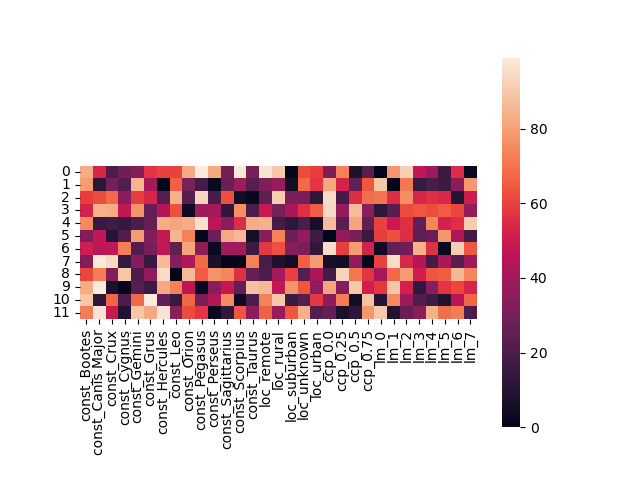

```python

```

\begin{center}
\begin{huge}
MCIS6273 Data Mining (Prof. Maull) / Fall 2025 / HW3
\end{huge}
\end{center}

| Points <br/>Possible | Due Date | Time Commitment <br/>(estimated) |
|:---------------:|:--------:|:---------------:|
| 16 | Wednesday November 12 @ Midnight | _up to_ 20 hours |


* **GRADING:** Grading will be aligned with the completeness of the objectives.

* **INDEPENDENT WORK:** Copying, cheating, plagiarism  and academic dishonesty _are not tolerated_ by University or course policy.  Please see the syllabus for the full departmental and University statement on the academic code of honor.

## OBJECTIVES
* Perform data imputation using K-Nearest Neighbors.

* Cluster data from GaN light pollution data features using K-Means.

* Visualize cluster data from GaN light pollution clustering.

* Complete the online assessment.

## WHAT TO TURN IN
You are being encouraged to turn the assignment in using the provided
Jupyter Notebook.  To do so, make a directory in your Lab environment called
`homework/hw3`.   Put all of your files in that directory.  Then zip or tar that directory,
rename it with your name as the first part of the filename 
(e.g. `maull_hw3_files.zip`, `maull_hw3_files.tar.gz`), then
download it to your local machine, then upload the `.zip` to Blackboard.

If you do not know how to do this, please ask, or visit one of the 
many tutorials out there
on the basics of using zip in Linux.

If you choose not to use the provided notebook, you will still need to turn in a
`.ipynb` Jupyter Notebook and corresponding files according to the instructions in
this homework.


## ASSIGNMENT TASKS
### (25%) Perform data imputation using K-Nearest Neighbors. 

As you noticed in doing HW2, if we look at the SQM measurements
there are a lot of missing values.  In fact more than 60%
of the data is missing SQM!  This is actually expected, since
the original GaN data was never intended to focus on quantitative
measurements.

We will ultimately like to have this data, even if it is 
not completely accurate, because it might be less compelling
to build predictive models based on a _smallish_ subset of data.

One of the main problems we will face, though, is that the
SQM measurements are not well distributed.  We're going to
ignore that for a moment, since there's not much that can be 
done just yet about it.

_Data imputation_ provides a mechanism for "filling" in 
this missing data.  There are a number of ways to do 
this -- one being to put in some random value for all missing 
values.  You 
might already realize that could be a sub-optimal 
thing to do.

The true intuition behind data imputation is this:

* given a set of missing values, fill in those missing values
  based on some criteria,
* sometimes we can just fill in missing values with the mean or median
  of the entire dataset,
* sometimes we'd like more sophistication, like in K-Nearest Neighbors
  imputation.

In K-Nearest Neighbors imputation, we look at features which are _not_ 
missing and look at similar data, compare _k_ of them which contain 
the absent features and fill in missing values from the _k_ means 
or medians.  This provides better approximations of missing data 
in large datasets -- it is akin to you deciding what color to paint 
your house based on the average of the colors of your
adjacent _k_ neigbors' homes. 

This is a critical task to perform in a lot of data, especially
when it is necessary to build models on as much data as possible.

Study the SciKit-Learn modules:

* [`KNNImputer`](https://scikit-learn.org/stable/modules/impute)

**&#167; Task:**  **1.1 Impute the data using K-Nearest Neighbor imputer in SciKit-Learn.**

Here you will remove all data except values which are `-1` and
between `17` and and `23` (inclusive of each).  You will also remove any data
which is duplicated using  `drop_duplicates()`.  It is recommended you
do this **before** constraining the `SQMReading`s. 


**&#167; Task:**  **1.2 Provide the updated statistics for the completed dataset which now includes
  original and imputed SQM values.**

* report mean, median and standard deviation of the **new** imputed data.


**&#167; Task:**  **1.3 Use Folium to plot the data for the bounding box and constraints given.**

* `Latitude` > 45.79 and < 45.92 ,
* `Longitude` > 15 and < 16,
* `SQMReading` above 20,
* Plot the original SQM Reading with red pins, plot the imputed data with blue pins,
* Include the `Latitude`, `Longitude` and `SQMReading` in the popup of the pin.


**&#167; Task:**  **BONUS: Implement your K-Nearest Neighbor imputation solution with only the `NearestNeighbors` algorithm of SciKit-Learn.**

Here you will write you own imputer without the help of the built-in one.

You can easily do this (and possibly improve the running time) by considering:

* use SciKit-Learn's [`NearestNeighbors`](https://scikit-learn.org/stable/modules/neighbors.html&#35;unsupervised-nearest-neighbors) algorithm **not** the `KNNImputer`
* compare nearest neighbors only by Latitude and Longitude (ignore that the distance Euclidean distance metric does not account for curvature 
  of the Earth, but is a good enough approximation for this dataset)
* use the median of the 5 nearest neighbors 
* plot the Folium map for the same region as above

This part can earn you up to 4 extra points!  Don't overthink this.  Only a few
lines of code are necessary if cleverly thought out.  You may find
using [`numpy`](https://numpy.org) will make things a little easier, then you may convert
back to Pandas if you wish (though that is not necessary).


### (50%) Cluster data from GaN light pollution data features using K-Means. 

In lecture, we talked about the value of clustering
to understand the patterns in underlying data
especially when there are a large number of 
instances and features.

We are going to use the clustering algorithms
in SciKit-Learn (for now K-Means) to uncover
the broader patterns in the data.

To do this we are going to complete a little
housekeeping with our dataset so that we have
all binary features.  Then we will cluster
and visualize our data.

**&#167; Task:**  **2.1 Convert `CloudCoverPct` and `LimitingMag` to binary features, eliminate all remaining non-binary features except `SQMReading`.**


Perform `get_dummies()` as was done in HW1.

You will need to create a final Dataframe with the following features:

* `SQMReading >= 17 and < 23`,
* `LimingMag` must be greater `0`,
* retain the following **32** columns:  `['SQM Reading','const_Bootes', 'const_Canis Major', 'const_Crux', 'const_Cygnus',
  'const_Gemini', 'const_Grus', 'const_Hercules', 'const_Leo',
  'const_Orion', 'const_Pegasus', 'const_Perseus', 'const_Sagittarius',
  'const_Scorpius', 'const_Taurus', 'loc_remote', 'loc_rural',
  'loc_suburban', 'loc_unknown', 'loc_urban', 'ccp_0.0', 'ccp_0.25',
  'ccp_0.5', 'ccp_0.75', 'lm_0', 'lm_1', 'lm_2', 'lm_3', 'lm_4', 'lm_5',
  'lm_6', 'lm_7']` where `ccp` indicates the 4 levels of cloud cover percent
  and `lm` indicates the 8 levels of limiting magnitude,
* the non-binary features: `Latitude`, `Longitude`, `Elevation(m)`, `LocalDateTime` , `CloudCoverPct` and `LimitingMag` will be eliminated.
 
An example data row might look like this:

|    |   `SQM Reading` |   `const_Bootes` |   `const_Canis Major` |  ... | `loc_ remote` |   ... |  `loc_ suburban` |   `ccp_0.0` |   ... |   `lm_7` |
|---:|----------------:|-----------------:|----------------------:|------|-------------:|-------|--------------:|----------:|------:|-------:|
|  0 |         19.7    |                0 |                   0   |  ... |            0 |   ... |             0 |  1        |   ... |      0 |

* save the Dataframe to a file called `gan_cluster_final.csv`.


**&#167; Task:**  **2.2 Use [`sklearn.cluster.kmeans`](https://scikit-learn.org/stable/modules/generated/sklearn.cluster.KMeans.html) to cluster the data in `gan_cluster_final.csv`.**

Review the algorithm [here](https://scikit-learn.org/stable/modules/clustering.html&#35;k-means).

* You will eliminate the `SQMReading` feature in your clustering,
* set `n_init=1` and `n_clusters=12` and `random_state=0`,
* use the label array that comes out of `kmeans` to assign 
  a new feature (column) called `cluster`,
* create a new file that contains the cluster label to all datapoints and 
  store it along with the original data in  
  `gan_cluster_final_assigned.csv` files, retaining the `SQMReading`.


**&#167; Task:**  **2.3 Use [`groupby()`](https://pandas.pydata.org/pandas-docs/stable/reference/api/pandas.DataFrame.groupby.html) to group by all the clusters.**

Now that every observation (row) has a cluster assignment,
we are going to group by those clusters.

This will effectively "add up" all the feature contributions
of each instance to the cluster.  Since they are all
binary, this makes the math very easy to see and 
makes these contributions obvious and potentially useful.

You will use [`.sum()`](https://pandas.pydata.org/pandas-docs/stable/reference/api/pandas.core.groupby.DataFrameGroupBy.sum.html&#35;pandas.core.groupby.DataFrameGroupBy.sum)
on `groupby()` to aggregate the data -- just remember 
to use the `cluster` as the key for grouping.

Once you complete the aggregation, save the cluster
groupings to a file called `gan_cluster_final_agg.csv`.  You 
will have 12 rows and 33 columns in your data, representing
the 12 clusters.


### (25%) Visualize cluster data from GaN light pollution clustering. 


Now that we have clusters, we should be able 
to visualize it.  Right now, it is a bunch
of numbers that might not make much sense --
there are too many numbers!

**&#167; Task:**  **Use the Seaborn library to display a heatmap of the data
  in `gan_cluster_final_agg.csv`.**

  In the `hw3_starter.ipynb` you may
  notice `!pip install seaborn`. **Don't forget this step**.

  You will have a heatmap that looks something like this:


  


  Notice the data in this heatmap is random, so **your**
  heatmap will look very different, indeed!


### (20%) Complete the online assessment. 


Please zip (or tar) the folder and subfolder for your assignment and submit it directly to Blackboard.

Once you are done with the coding part of the assignment, you will need to complete the online assessment for
the final 4 points (20%) of your grade.

**&#167; Task:**  **Turn in your solution and complete the online HW3 assessment.**


